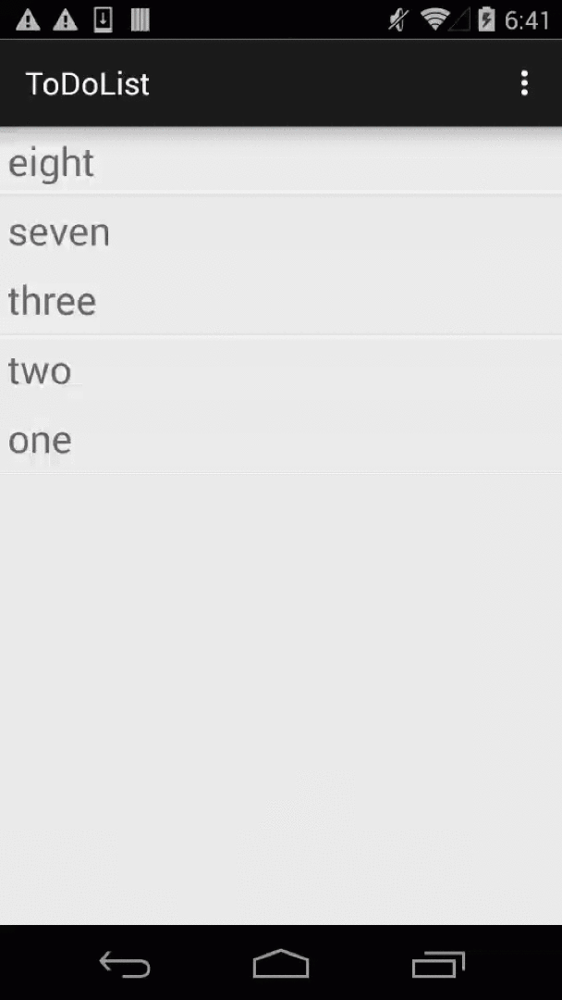

# MaxLeap-Sample-Todo-Android

## 简介

Todo 是 MaxLeap SDK 的一个 Sample，该项目依赖于 MaxLeap 的基础模块。通过该应用你可以学习和了解基于 MaxLeap SDK 的基本 CRUD 操作。

## 效果

## 使用

1. 打开 Android Studio 或 IDEA ，点击菜单项 `File -> Open ` 选择 `setting.gradle` 文件导入工程.
2. 打开 `App.java` 文件，使用你自己的 `APP Id` 和 `API KEY` 替换该文件中已定义的同名常量。
